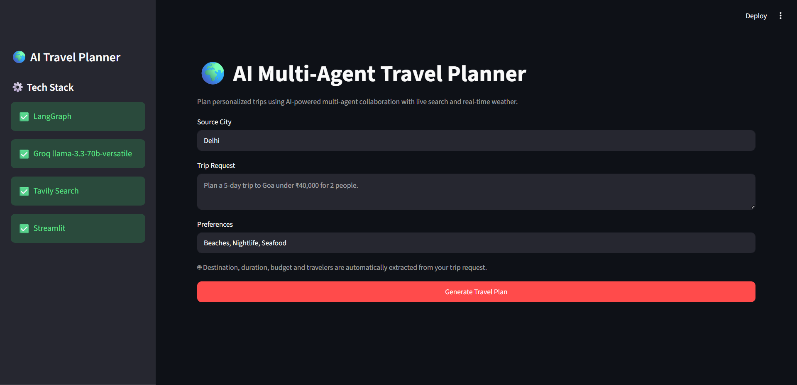
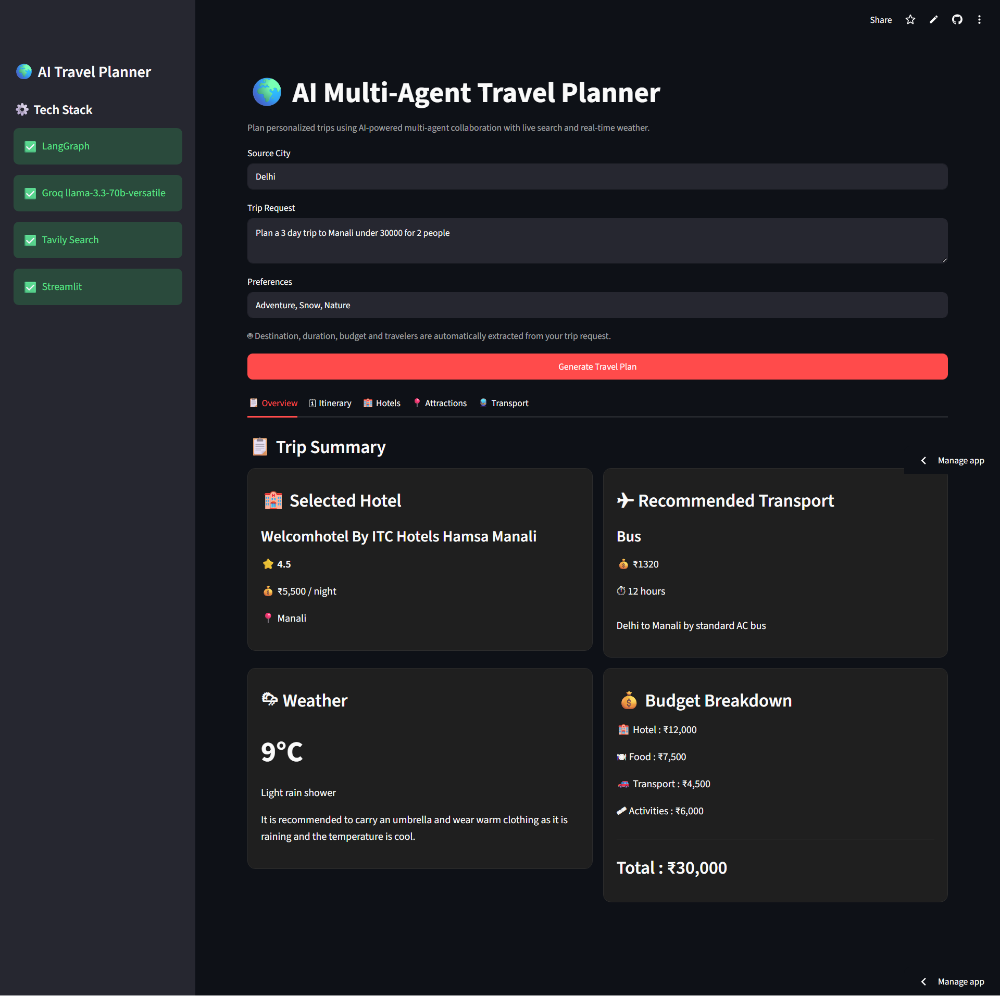
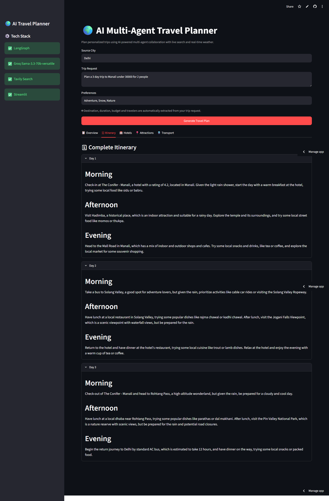
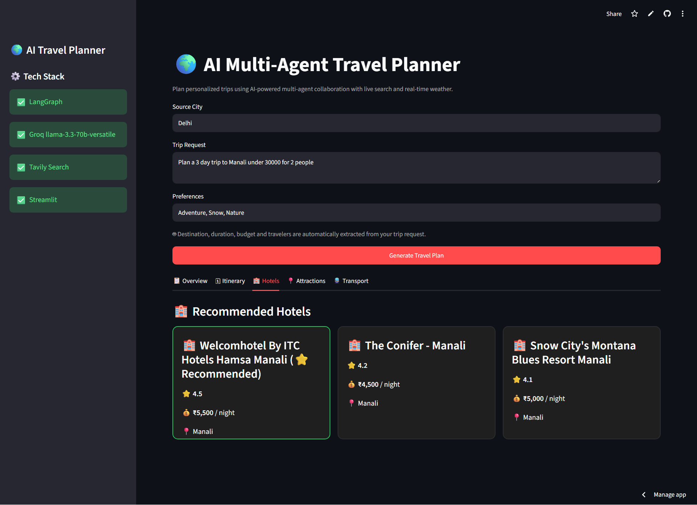
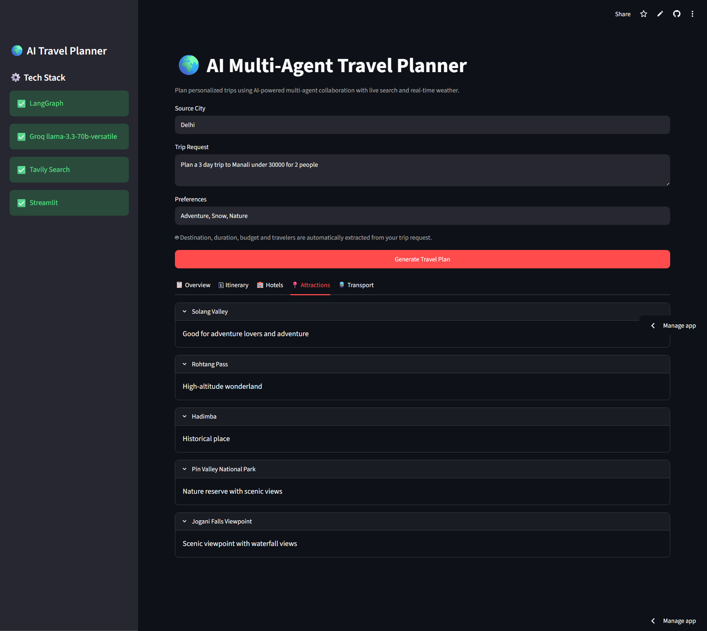
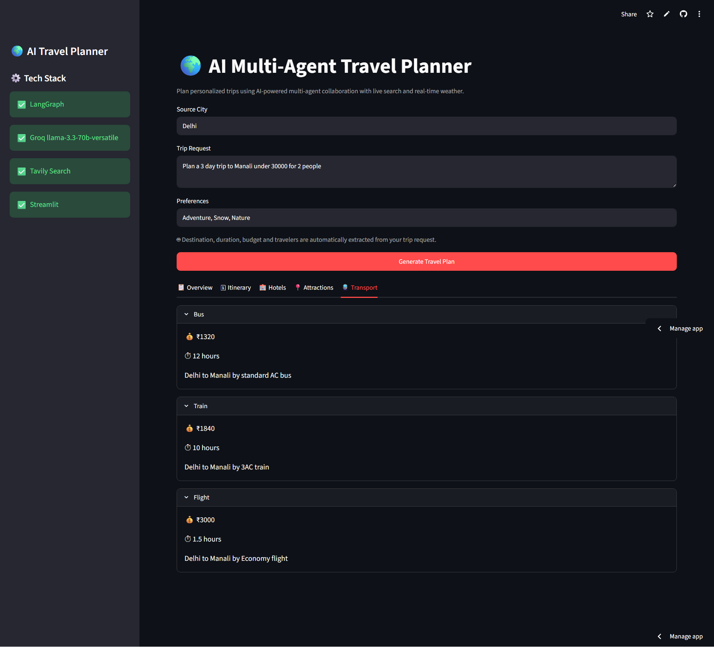

# 🌍 AI Multi-Agent Travel Planner


An AI-powered travel planning application built using **LangGraph**, **Groq Llama 3.3**, **Tavily Search**, and **Streamlit**.

The application uses multiple specialized AI agents that collaborate to generate personalized travel plans including destination recommendations, weather, hotels, attractions, transport, budget allocation, and a complete day-wise itinerary.

---

## 🚀 Live Demo

https://ai-multi-agent-travel-planner.streamlit.app/

---

## ✨ Features

- 🤖 Multi-Agent AI workflow using LangGraph
- 🗺️ Intelligent travel planning
- 🌦️ Real-time weather information
- 🏨 Hotel recommendations
- 🚗 Transport suggestions
- 📍 Tourist attractions
- 📅 Day-wise travel itinerary
- 💰 Automatic budget planning
- 🔍 Live web search using Tavily
- ⚡ Fast inference using Groq Llama 3.3
- 🎨 Interactive Streamlit UI

---

## 🧠 AI Agent Architecture

The application consists of multiple specialized agents working together.

- 📍 Destination Agent
- 🌦️ Weather Agent
- 🏨 Hotel Agent
- 🚗 Transport Agent
- 📍 Attractions Agent
- 📅 Itinerary Agent
- 💰 Budget Agent

Each agent performs one dedicated task and passes its output to the next agent through a shared LangGraph state.

---

## 🛠️ Tech Stack

| Technology              | Purpose |
|-------------------------|---------|
| Python                  | Backend |
| LangGraph               | Multi-Agent Workflow |
| Groq API                | LLM Inference |
| Llama 3.3 70B Versatile | Language Model |
| Tavily Search           | Live Search |
| Pydantic                | Structured Output |
| Streamlit               | User Interface |

---

## 📂 Project Structure

```text
AI_Multi_Agent_Travel_Planner/
│
├── agents/
├── graph/
├── prompts/
├── tools/
├── utils/
├── tests/
├── app.py
├── requirements.txt
└── README.md
```

---

## ⚙️ Installation

### Clone Repository

```bash
git clone https://github.com/vaibhavsachdeva16/AI-Multi-Agent-Travel-Planner.git

cd AI-Multi-Agent-Travel-Planner
```

---

### Create Virtual Environment

```bash
python -m venv venv
```

Activate

Windows

```bash
venv\Scripts\activate
```

Linux/Mac

```bash
source venv/bin/activate
```

---

### Install Dependencies

```bash
pip install -r requirements.txt
```

---

### Configure Environment Variables

Create a `.env` file

```env
GROQ_API_KEY=your_groq_api_key

TAVILY_API_KEY=your_tavily_api_key
```

---

### Run the Application

```bash
streamlit run app.py
```

---

## 📸 Screenshots

### Home



### Trip Overview



### Itinerary



### Hotel Recommendations



### Attractions



### Transport



---

## 🔄 LangGraph Workflow

```text
User Input
     │
     ▼
Destination Agent
     │
     ▼
Budget Agent
     │
     ▼
Hotel Agent
     │
     ▼
Weather Agent
     │
     ▼
Attractions Agent
     │
     ▼
Transport Agent
     │
     ▼
Itinerary Agent
     │
     ▼
Final Travel Dashboard
```

---

## 💡 Future Improvements

- Flight API integration
- Google Maps integration
- Hotel booking links
- PDF itinerary download
- Multi-city travel planning
- Cost optimization
- Currency conversion
- User authentication

---

## 👨‍💻 Author

**Vaibhav Sachdeva**

GitHub: https://github.com/vaibhavsachdeva16

LinkedIn: https://www.linkedin.com/in/vaibhavsachdeva7